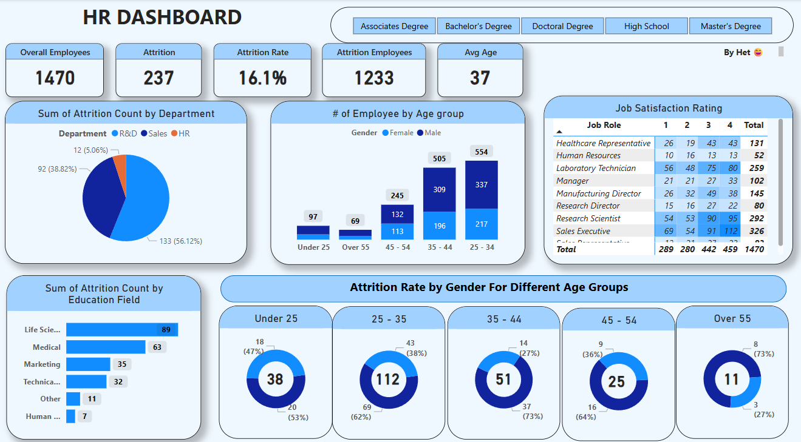

# 📞 Call Center Dashboard

This interactive Call Center Dashboard provides a comprehensive overview of key performance indicators (KPIs) relevant to call center operations, such as agent performance, call resolution stats, and daily call metrics.



---

## 📊 Features

- **Total Calls & Resolutions:** Displays overall incoming calls and resolved queries.
- **Agent Performance:** Tracks individual agent metrics including resolution rate and call handling.
- **Call Distribution:** Visual representation of call volume across days and hours.
- **Resolution Time Analysis:** Breaks down how efficiently issues are being resolved.
- **Customer Satisfaction Indicators:** (Optional if available) Tracks feedback and ratings.

---

## 🛠️ Tech Stack

- **Power BI** (or Tableau/Excel – replace with your actual tool)
- **CSV/Excel data sources** (e.g., call logs, agent performance sheets)
- **Data Modeling:** Cleaned and transformed using built-in Power BI tools

---

## 🚀 How to Run

1. Clone or download this repository.
2. Open the `.pbix` or relevant dashboard file in **Power BI Desktop**.
3. Ensure data sources are connected properly (update file paths if required).
4. Click on `Refresh` to update visualizations with current data.
5. Interact with the dashboard using filters and slicers.

---

## 📁 Files

```bash
.
├── Call_Center_Dashboard.pbix       # Main dashboard file (Power BI)
├── data/
│   ├── agent_performance.csv
│   ├── call_logs.xlsx
├── screenshot.png                   # Dashboard screenshot for preview
└── README.md
🧑‍💻 Author

Het Savla
📌 Notes
You can export the dashboard as a PDF or embed it into web platforms for client reporting.

Customize filters to show trends over specific agents, months, or categories.

📄 License
This project is open-source and free to use under the MIT License.

yaml
Copy
Edit

---

Let me know if:
- You want me to generate a **high-quality dashboard image** using AI.
- The dashboard was made in Excel/Tableau instead of Power BI.
- You want to publish it to a **portfolio site** or attach a demo link.

I can adjust everything accordingly!


